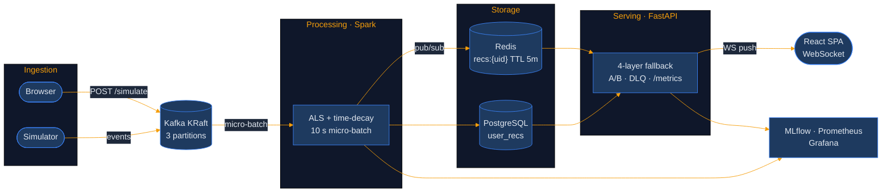
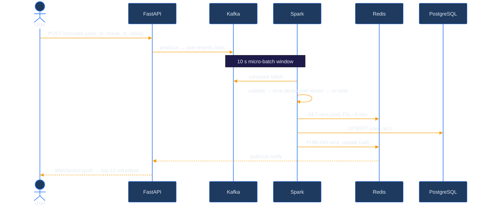

# CineMatch — Real-Time Movie Recommendation System


End-to-end recommendation system: user events flow through Kafka → Spark Structured Streaming → ALS time-decay re-ranking → personalized top-10 served under 5 ms. Built on MovieLens 1M (1M ratings, 6,040 users, 3,883 movies).


## System Architecture



## Stack

| Layer | Technology |
|-------|-----------|
| Streaming | Kafka 3.9 KRaft (no Zookeeper) · Spark 3.5 Structured Streaming |
| ML | Spark ALS rank-50 · time-decay CF + genre hybrid scoring |
| Storage | Redis 7 (RDB+AOF, pub/sub) · PostgreSQL 16 |
| API | FastAPI 0.111 · asyncpg · WebSocket · Prometheus middleware |
| Frontend | React 18 · TypeScript · Tailwind CSS · Vite → Nginx |
| MLOps | MLflow 2.13 · Prometheus 2.51 · Grafana 10.4 |
| Runtime | Python 3.12 · Node 20 · Docker Compose (10 services) |

---


## Real-Time Event Cycle



---
## Quick Start

**Prerequisites:** Docker + Docker Compose, `uv` (for local tests)

```bash
make up          # start all 10 services
make bootstrap   # download MovieLens 1M, train ALS, seed Redis + Postgres (~5 min)
make streaming   # start Spark Structured Streaming job
make demo        # open http://localhost:3000
```

| URL | Service |
|-----|---------|
| http://localhost:3000 | React frontend |
| http://localhost:8000 | FastAPI (JSON) |
| http://localhost:3001 | Grafana dashboards (admin / admin) |
| http://localhost:5000 | MLflow experiment tracker |

---

## How It Works

**Bootstrap (one-time, ~5 min):**
Downloads MovieLens 1M → trains ALS (rank=50, regParam=0.1) → leave-one-out offline eval → writes item factors, top-100 ALS candidates, cosine-similar neighbors, and exposure-damped popularity into Redis → logs NDCG@10 + Precision@10 to MLflow and `model_runs` table.

**Streaming pipeline (every 10 s):**
Spark reads Kafka micro-batch → validates events (invalid → DLQ) → builds per-user preference vector → re-ranks ALS top-100 with CF score + genre bonus → writes top-10 to Redis + Postgres → publishes via pub/sub → FastAPI WebSocket pushes to browser.

**Scoring:**
```
weight        = exp(−0.001 × age_s) × type_weight × rating_weight
  type_weight:  click=1.0  view=1.5  like=2.5  rating=3.0
                (like is emitted by the UI, not the classic simulator)
  rating_weight = 0.4 + star/5 × 0.6   (1★→0.52, 5★→1.0; any rating beats any view)

pref    = Σ weight_i × item_factor[movie_id_i]   (L2-normalized unit vector)
score   = dot(pref, item_factor) + 0.15 × genre_overlap
          diversity penalty: from the 4th title of a primary genre,
          score → sign(score) · |score| · 0.7^(c−2), c = earlier same-genre titles
```

**4-layer fallback — no blank page:**

| Priority | Source | Latency |
|----------|--------|---------|
| 1 | Redis `recs:{uid}` — Spark re-ranked, TTL ~5 min | < 2 ms |
| 2 | Postgres `user_recs` — durable, skipped if > 30 min stale | 5–15 ms |
| 3 | Redis `als_candidates:{uid}` — ALS baseline, permanent | < 2 ms |
| 4 | Redis `popular:global` — exposure-damped top-100, cold-start | < 2 ms |

---

## MLOps & Observability

**A/B testing** — deterministic hash bucketing (no state), and the assignment genuinely gates serving: **control** users always receive the static ALS bootstrap order (`als_candidates:{uid}`) and never the Spark-personalized cache; **treatment** users receive event-driven re-ranked lists (`recs:{uid}`), falling back through durable/static layers when absent. Groups diverge only after events trigger re-ranking — an un-evented treatment user also sees the ALS baseline. Impressions + engagements tracked per variant → `GET /stats/ab`. The UI shows your group and what it means (status-bar chip + banner above Top Picks).

**Model hot-reload** — every 60 batches (~10 min), streaming job checks `model:version` in Redis. Changed → reloads item factors in-place, no job restart.

**Prometheus metrics** (`GET /metrics`):

| Metric | Type | Description |
|--------|------|-------------|
| `api_latency_ms` | Histogram | Request latency by endpoint |
| `cache_hit_total` | Counter | Redis hit / miss — incremented by the API on every serve path (result=true only for the hot personalized cache) |
| `recsys_dlq_events_total` | Gauge | Invalid events in dead-letter queue |
| `recsys_model_ndcg_at_10` | Gauge | NDCG@10 from last bootstrap |

**ML + debug endpoints:**

```
GET /stats/ml             offline NDCG@10, Precision@10 from last bootstrap
GET /stats/ab             live CTR by A/B variant
GET /stats/model-history  NDCG / Precision across all training runs
GET /events/dlq           last 10 invalid events with failure reason
```

---

## Useful Commands

```bash
# fire a manual event
curl -X POST http://localhost:8000/simulate \
  -H "Content-Type: application/json" \
  -d '{"user_id": 1, "movie_id": 50, "event_type": "rating", "rating": 5}'

# check recommendations + observability
curl http://localhost:8000/recommend/1 | jq
curl http://localhost:8000/stats/ab | jq
curl http://localhost:8000/stats/ml | jq

# inspect Redis state
docker exec redis redis-cli GET recs:1
docker exec redis redis-cli GET model:version
docker exec redis redis-cli LLEN dlq:recent

make logs   # follow spark + api + simulator logs
make test   # run pytest (37 tests)
```

---

## Demo deployment notes

This stack targets local demonstration: Postgres/Redis/Kafka ports are
published to the host with default demo credentials (`recsys:recsys`,
no auth on Redis), and Grafana allows anonymous viewer access. Do not run it
on an untrusted network without changing `.env`, removing the port
publishings, and disabling anonymous Grafana auth.
